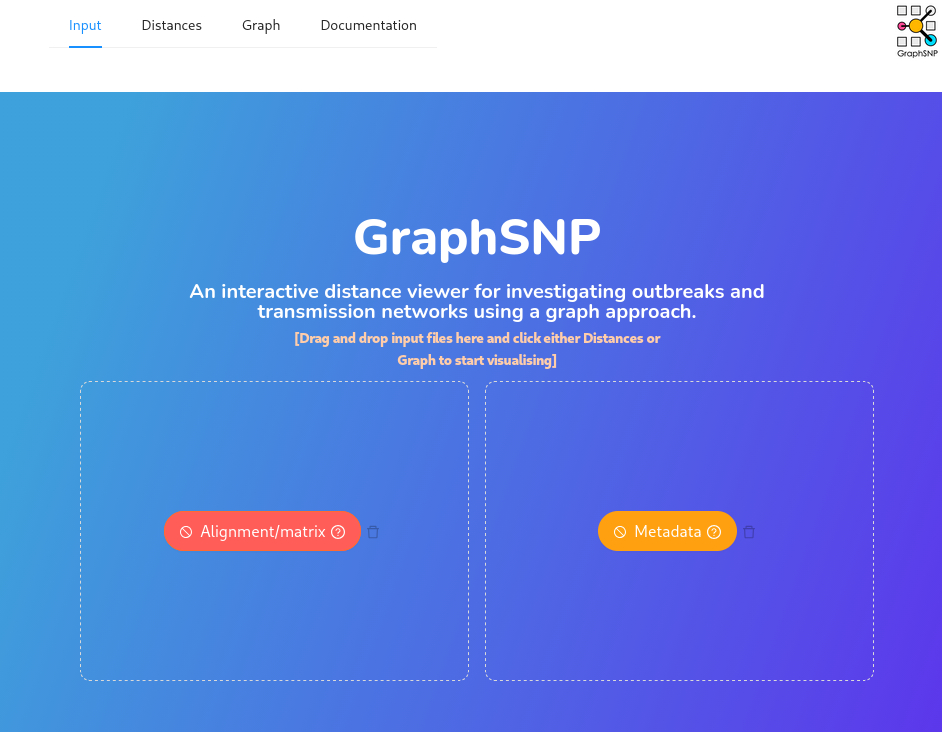
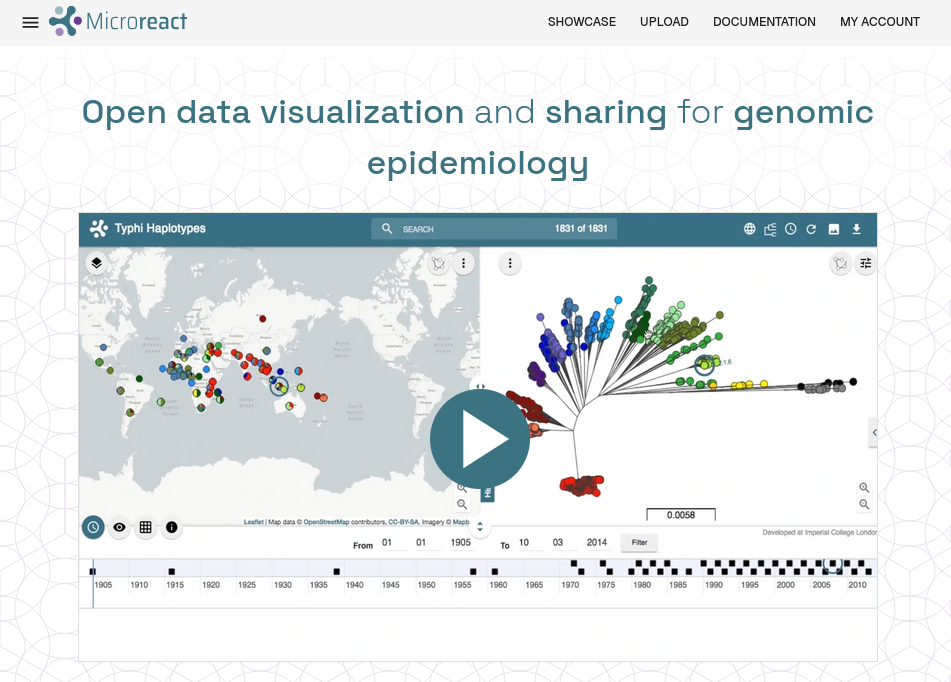
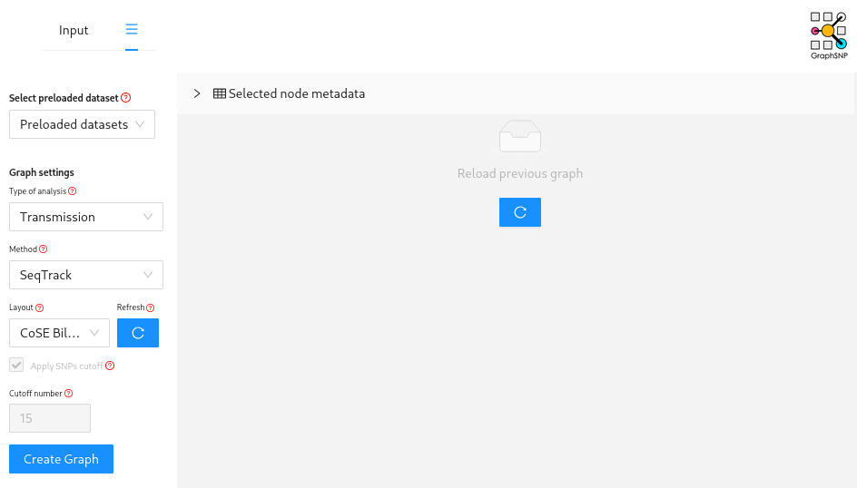

# Module 4 Outbreak Analysis

*Author: Finlay Maguire*

*Last Modified: 2025-11-11*

## Lecture

Link to PDF of slides from google

## Lab

1. [Background](#intro)
2. [Setup](#setup)
3. [Cluster Identification](#cluster)
4. [SNP Analysis](#snp)
5. [Transmission Inference](#trans)

In this lab practical we will be using microbial genomes (and associated contextual metadata) to investigate a suspected nosocomial (hospital-acquired) outbreak of *Methicillin resistance Staphylococcus aureus* (MRSA) in a UK-based Neonatal Intensive Care Unit (NICU).  The data we are using comes from a classic study which demonstrated the utility of whole genome sequencing for investigating an MRSA outbreak within a Special Care Baby Unit (also known as a NICU) of the Cambridge University Hospitals NHS Foundation Trust (CUH).

> Harris SR, Cartwright EJP, Török ME, et al. Whole-genome sequencing for analysis of an outbreak of methicillin-resistant Staphylococcus aureus: a descriptive study. *Lancet Infect Dis* 2012 [10.1016/S1473-3099(12)70268-2](http://dx.doi.org/10.1016/S1473-3099\(12\)70268-2)

This practical will step you through the genomic components of a typical nosocomial bacterial outbreak investigation, specifically:

- Identifying potential outbreak clusters
- Determining SNP distances
- Inferring outbreak phylogenies
- Performing transmission inference

<a name="intro"></a>

### Background

*Staphylococcus aureus* is a Gram-positive coccoidal bacteria that forms a normal commensal member of the microbiome in 20-40% of people ([Karsten, 2017](https://doi.org/10.1016/j.ijmm.2016.11.007)). However, when skin and mucosal barriers are disrupted (e.g., through medical procedures such as catheterisation, tracheal tubes, surgeries) *S. aureus* can cause opportunistic invasive infections ([Lee, 2018](https://doi.org/10.1038/nrdp.2018.33)).   

Since the 1960s, variants have emerged and spread globally that are resistant to the majority of β-lactam antibiotics through the independent acquisitions of the staphylococcal cassette chromosome mec (SCCmec) ([IWG-SSC, 2009](https://doi.org/10.1128/AAC.00579-09).  This combination of commensal carriage, antimicrobial resistance, and healthcare-associated infection opportunities (along with additional virulence factors) have led to MRSA becoming a leading cause of hospital-associated mortality and morbidity globally ([GBD, 2024](https://doi.org/10.1016/s0140-6736(24)01867-1)). Therefore, tracking and preventing MRSA outbreaks is a major priority for infection prevention and control (IPAC or IPC) within hospital settings especially within the NICU due to the vulnerability of immunocompromised preterm infants and the high frequency of invasive procedures.
This has led to adoption of genomic epidemiological approaches to detect MRSA outbreaks and track transmission links not apparent from traditional approaches alone ([Blane, 2024](https://doi.org/10.1099/mgen.0.001235)). These sort of outbreak investigations are generally led by the infection prevention & control (IPAC or IPC) team in a clinical setting or by the relevant public health team depending on the suspected infection source, geographic scale, and regional resource availability (e.g., Public Health Agency of Canada/Canadian Food Inspection Agency or provincial bodies like Public Health Ontario). 

Within the SCBU/NICU of Cambridge University Hopitals NHS Trust (and most hospitals) all inpatients are screened for MRSA carriage upon admission and once per week thereafter using culture-based or nucleic-acid based test. Specific IPAC policies and guidelines will determine criteria for initiating an outbreak investigation (e.g., a certain number of positive screens within a specific time and/or location).  

Routine surveillance has identified that 3 infants within the SCBU/NICU (P11-P13) are positive for MRSA carriage at the same time. Isolates from these 3 infants have also been shown to have the same pattern of antibiotic resistances. The IPAC team has therefore been activated to further investigate this as a suspected outbreak in the SCBU/NICU at CUH. 
They have performed a systematic review of all MRSA isolates from the SCBU/NICU over the preceding 6-12 months and identified a series of overlapping MRSA carriages with this same set of resistances. Due to multi-week gaps in the positive SCBU/NICU isolates they have also collected potentially matching MRSA isolates from parents and the wider hospital/community.  To gain better insight into this potential outbreak and identify which of these isolates are linked by direct transmission chains, CUH have sequenced these isolates using 150bp paired-end reads via an Illumina MiSeq platform.

:::: {.callout type="purple"}
You are a clinical bioinformatician who has been asked to support the investigation and analyses these genomes
::::

<a name="setup"></a>

### Set-Up

This lab practical will involve running the following software:

* [mlst](https://github.com/tseemann/mlst)
* [poppunk](https://github.com/bacpop/PopPUNK)
* [ska](https://github.com/bacpop/ska.rust)
* [gubbins](https://github.com/nickjcroucher/gubbins)
* [IQTree](https://github.com/iqtree/iqtree3)
* [GraphSNP](https://graphsnp.fordelab.com/)

:::: {.callout type="blue" style="subtle" title="Note: Bioinformatics in Practice" collapsible="true"}

Typically, most of these analyses would be run using a workflow such as [bactopia](https://bactopia.github.io/latest/) that you are confident will reproducibly generate validated and verified outputs (ideally as part of your institution's ISO15189 accreditation or equivalent).  We will run the tools directly today so you get insight into what these workflows are actually doing!

::::

#### Data

Using ssh connect to the provided analysis server instance:

```bash
ssh -i YOUR_KEY.pem YOUR_USER@XX.uhn-hpc.ca
```

Now create a folder in your `~/workspace` and copy/link over the files you will need:

```bash
mkdir -p ~/workspace/module4
cd ~/workspace/module4
cp -r ~/CourseData/module4/contextual_data.csv  ~/CourseData/module4/SASCBU26_reference.fna .
ln -s ~/CourseData/module4/assemblies .
```
:::: {.callout type="blue" style="subtle" title="Note: Contextual Data 'Interpolation'" collapsible="true"}

Specific collection dates were not available so have been inferred based on relative sampling gaps

::::

When you are finished with these steps you should be inside your work directory `~/workspace/module4`. You can verify this by running the command `pwd`.
s
**Output after running `pwd`**

```bash
~/workspace/module4
```

You now see an `assemblies/` folder in the current directory along with a `contextual_metadata.tsv` (all the contextual data needed for this analysis) and `SASCBU26_reference.fna` (the reference genome we will use later):

**Output after running `ls`**s

```bash
SASCBU26_reference.fna  assemblies  contextual_data.csv
```

#### Activate environment

Next we will activate the pre-installed [conda](https://docs.conda.io/en/latest/) environment, which will have all the tools needed by this tutorial pre-installed. To do this please run the following:

**Commands**
```bash
conda activate outbreak
```

You should see the command-prompt (where you type commands) switch to include `(outbreak)` at the beginning, showing you are inside this environment. You should also be able to run the `mlst` command like `mlst --version` and see output:

**Output after running `mlst --version`**
```bash
mlst 2.23.0
```

#### Find your IP address

Similar to yesterday, we will want to either use the assigned hostname (e.g., xx.uhn-hpc.ca where xx is your instance number) or find the IP address of your machine on AWS so we can access some files from your machine on the web browser. To find your IP address you can run:

**Commands**
```bash
curl http://checkip.amazonaws.com
```

This should print a number like XX.XX.XX.XX. Once you have your address, try going to <http://xx.uhn-hpc.ca> or <http://IP-ADDRESS> and clicking the link for **module4**. This page will be referred to later to easily download/view some of our output files. 

<a name="cluster"></a>

### Cluster Identification

All isolates that are putatively linked to the outbreak have been done so on the basis of time, location, and phenotype (specifically antibiotic susceptibilities). However, just because 2 isolates have the same resistance pattern does not mean they are closely related. 
Although this is a relatively small set of isolates we are often evaluating very large numbers of genomes for their potential connection to an outbreak.
Additionally, most downstream outbreak analyses (such as transmission inference) perform best when applied to as little diversity as possible (i.e., just genomes from a single outbreak event).

This means our first task is to identify and group which isolates are actually connect


are likely to be linked using the sort of typing methods you encountered in the previous lab practical.
This helps us to eliminate unrelated genomes and determine whether 1 or more outbreaks are likely to be taking place.

To make things faster for this practical, we have provided pre-inferred genome assemblies (generated using [shovill](https://github.com/tseemann/shovill) with the [skesa](https://github.com/ncbi/SKESA) assembler).

You can infer the 7-gene MLST using the [pubMLST *Staphylococcus aureus* scheme](https://pubmlst.org/organisms/staphylococcus-aureus) by running the `mlst` tool on each of the genome assemblies.

```bash
mkdir -p outbreak_cluster_identification; cd outbreak_cluster_identification
mlst --scheme saureus ../assemblies/*.fa > mlst.tsv
```

Now download the `mlst.tsv` output file (using either `scp` or the IP address listed above) and open it in your tabular data tool of choice (e.g., pandas/python, R, excel).

**Based on these results, which genomes do you suspect may not be part of this outbreak?**

:::: {.callout type="green" title="Answer" collapsible="true"}

- P27 & P28 have different MLSTs (ST1 and ST8) to any other genome so unlikely to be linked to an outbreak.
- P29 & P34-38 (with P37 a partial match) could be an ST22 outbreak.
- P30-33 could be an ST772 outbreak.
- All remaining isolates belong to a large ST2731 set

::::

**Why might genomes with a different MLST still be closely related or those with the same MLST be relatively unrelated?**

:::: {.callout type="green" title="Answer" collapsible="true"}

MLST are only 7 genes so a small amount of mutation (or conservation!) in just these genes can lead to a totally different MLST - schemes are designed to try and be robust but are mutation is a random process with high variance!

::::

We could solve this challenge using a more fine-grained scheme like cg/wgMLST (as discussed in the previous module) but we are going to use `poppunk` in this lab.

`poppunk` is a rapid k-mer based genome clustering tool that groups genomes together based on both their core and accessory genome distances.  This allows differential clustering of similar genomes which have acquired novel plasmids and so on.  

The developers of poppunk provide some pre-computed databases (although it is relatively easy to create your own) for different species which are available [here](https://www.bacpop.org/poppunk-databases/).

We have already downloaded a reference database for you, so all you have to do is prepare a 2-column file `genomes.txt` which has a series of names in the first column and the path to the related genome assembly in the other.
We can do this using a quick bash one-line loop:

```bash
for i in ../assemblies/*.fa; do isolate=$(echo $i | cut -d '/' -f3 | cut -d '.' -f1); echo -e "$isolate\t$i" >> genomes.txt; done
```

Then we can run the following to get poppunk cluster assignments:

```bash
poppunk_assign --db ~/CourseData/module4/staphylococcus_aureus_v1_full --query genomes.txt --output poppunk
```

Now download/inspect `poppunk/poppunk_clusters.csv` file 

**Which genomes does this analysis suggest should be excluded?  Do they match the MLST results?**

:::: {.callout type="green" title="Answer" collapsible="true"}

P27-28 are assigned to cluster 1 and P30-33 are assigned cluster 12.  Remaining samples are assigned to cluster 3. 

- P27 and P28 were different singleton STs for MLST that share a few alleles so supports eliminating them
- P30-33 were ST772 so poppunk and MLST agree and support eliminating these samples (although they could be their own distinct outbreak)
- ST22 and ST2731 isolates were both assigned to cluster 3. If we look carefully at the MLST profile for these STs in `mlst.tsv` we can see that these STs only differ by a single allele (arcC) so could be linked in the main outbreak.

We can't be sure about cluster 3 without further analysis but we can drop cluster 1 and 12 for now.
::::

<a name="snp"></a>

### SNP Analysis

Now that we have eliminated some isolates that are unlikely to be connected to our main outbreak we can do a deeper analysis of the evolutionary relationships between our isolates.  For this we are going to perform a phylogenetic analysis. There are several way this could be done: 

- Inferring and aligning the core genome of our isolates by running a tool like `panaroo` on the genome assembly annotation files (generated with `prokka` or `bakta`).
- Mapping individual reads against a reference genome with a tool like `snippy`.
- Mapping SNPs between genomes using `ska` (then using a reference to order these SNPs)

**For SNP analyses, why might we want use a reference derived from an outbreak isolate instead of standard species reference genome?**

:::: {.callout type="green" title="Answer" collapsible="true"}

We maximise the number of detectable SNPs by using a reference as close as possible to our other genomes

::::

For this lab, we are going to do the last option using a complete high quality reference genome generated from this outbreak subsequent to the original manuscript: SASCBU26

First let's generate the input file for SKA using the poppunk results

```bash
cd ~/workspace/module4; mkdir -p ska_phylogeny; cd ska_phylogeny
paste <(grep "3$" ../outbreak_cluster_identification/poppunk/poppunk_clusters.csv | cut -d, -f1) <(grep "3$" ../outbreak_cluster_identification/poppunk/poppunk_clusters.csv | cut -d, -f1 | perl -ne 'chomp; print "../assemblies/$_.fa\n"' ) > ska_input
echo -e "SASCBU26\t../SASCBU26_reference.fna" >> ska_input
```

Now we need to generate an SKA index:

```bash
ska build -f ska_input -k 31 -o ska_index --threads 4
```

Then map these split k-mers against the reference (required to order them for the next step):

```bash
ska map -o ska.aln --ambig-mask ../SASCBU26_reference.fna ska_index.skf
```

This gives us an alignment but due the distorting effects of recombination we typically want to try and remove any potential recombinant sites from the alignment.  There are several tools that can help us do this (`verticall`, `ClonalFrameML`, `gubbins`) and today we are going to use `gubbins`.

```bash
mkdir -p gubbins
run_gubbins.py --prefix gubbins/gubbins ska.aln
mask_gubbins_aln.py --aln ska.aln --gff gubbins/gubbins.recombination_predictions.gff --out gubbins.masked.aln
```

Now that we have a masked alignment `gubbins.masked.aln` we can analyse the SNP network using [GraphSNP](https://graphsnp.fordelab.com/) to further refine our potential outbreak samples.  First, generate a SNP distance matrix using `snp-dists`:

```bash
snp-dists gubbins.masked.aln | sed 's/\t/,/g' > raw_outbreak_matrix.csv
```

Now download the `raw_outbreak_matrix.csv`, navigate to [GraphSNP](https://graphsnp.fordelab.com/) in your browser, and upload the `raw_outbreak_matrix.csv` as your Alignment/matrix.

```{r echo=FALSE}
   
```

Then click on "Graph" at the top of the page (may be hidden behind 3 horizontal lines on smaller screens), increase your "Cutoff number" to 50, and then hit the "Create Graph" button.

```{r echo=FALSE}
   
```

This will create a minimum spanning tree grouped using a 50 SNP cut-off.

**Which genomes do you think you can eliminate from being part of these immediate outbreak cluster?**

:::: {.callout type="green" title="Answer" collapsible="true"}

Based on the graph, isolates P29 & P34-P38 can be eliminated.  These were the ST22 isolates identified by `mlst` that poppunk convinced us to look at a bit more closely.  We can see the closest is only ~80 SNPs from our outbreak cluster.
 
::::

Let's also look at these isolates using a traditional phylogenetic approach. Go back to the server and run the following command to build a maximum-likelihood tree using `iqtree`:

```bash
iqtree -s gubbins.masked.aln
```
This will generate a lot of outputs but if you download the newick formatted phylogeny `gubbins.masked.aln.treefile` and go to [microreact](https://microreact.org/upload) we can visualise the tree.

Hit the "Upload" button and select your treefile.
```{r echo=FALSE}
   
```

```{r echo=FALSE}
  knitr::include_graphics("content-files/microreact_upload2.jpg") 
```

Then hit the settings slider icon at the top right 

```{r echo=FALSE}
  knitr::include_graphics("content-files/microreact_upload3.jpg") 
```

Finally, select radial/unrooted tree.

```{r echo=FALSE}
  knitr::include_graphics("content-files/microreact_upload4.jpg") 
```

**Does the phylogeny show the same genomes as being outside the main outbreak cluster**

:::: {.callout type="green" title="Answer" collapsible="true"}
Yes, P37 & P38 are close to the main outbreak cluster and could be included but for now we will exclude them.
::::


Now we have refined our final set of suspected outbreak isolates we can create our final alignment of just these sequences.

**Create a SNP distance matrix and phylogeny for just the final outbreak isolates by repeating the above steps with a modified ska_input (if you create a new folder you'll avoid getting mixed up with your new datas).**

:::: {.callout type="blue" style="subtle" title="If stuck/time-crunched" collapsible="true"}

A pre-computed distance matrix and phylogeny can be copied from `~/CourseData/module4/refined_outbreak_matrix.csv` and `~/CourseData/module4/refined.gubbins.masked.aln.treefile` 

::::

<a name="trans"></a>
### Transmission Inference

With our refined outbreak distance matrix and phylogeny we are going to perform some transmission analyses by combining these with some of our context data.  

First we are going to use the [SeqTrack](https://pmc.ncbi.nlm.nih.gov/articles/PMC3183872/) method as implemented in [GraphSNP](https://graphsnp.fordelab.com/).

To do this download  `contextual_metadata.csv` and your refined distance matrix (e.g., `refined_outbreak_matrix.csv` or whatever you have named it) and then navigate to [GraphSNP](https://graphsnp.fordelab.com/).  
This time you must upload the new distance matrix under Alignment/matrix and the metadata table under Metadata.

```{r echo=FALSE}
   
```


Then navigate to "Graph" but this time select analysis type "transmission" and click "Create Graph"


```{r echo=FALSE}
   
```


**Which person is inferred to have infected the largest number of other patients?**

:::: {.callout type="green" title="Answer" collapsible="true"}
P8 or P4
::::

**Which baby/babies was/were inferred to be infected by a parent?**

:::: {.callout type="green" title="Answer" collapsible="true"}
P13 and P15 
::::

:::: {.callout type="purple"}
Congratulations you've performed your first transmission analysis!
::::

The next step would be to try and perform a more sophisticated transmission inference method using `TransPhylo`.
However, this would require us to infer a time-scaled phylogeny and you'll discover more about how to do that in the next module!

<!--
```R
library(BactDating)
dist_tree <- ape::read.tree("~/workspace/module4/PATH_TO_FINAL_IQTREE.tre")

dates <- read.csv("~/CourseData/module4/contextual_data.csv") 
rownames(dates) <- dates$sample_id
dates <- lubridate::decimal_date(lubridate::ymd(dates[dist_tree$tip.label, "collection_date"]))
res <- roottotip(dist_tree, dates)
res <- bactdate(ape::unroot(dist_tree),dates,nbIts=1000)
plot(res,'treeCI',show.tip.label = F)
ttree <- res$tree
```

Now we can use transphylo to perform transmission inference

```R
library(TransPhylo)
ptree<-ptreeFromPhylo(ttree,dateLastSample=max(dates))
```
-->
